# TheSandwichLoop

## The Sandwich Loop is a Java-based point-of-sale (POS) application designed for a sandwich shop. It provides a user-friendly interface for customers and staff to create, customize, and manage sandwich orders seamlessly.

###  Features

- Customizable Sandwich Orders: Choose bread type, sandwich size (4", 8", 12"), meats, cheeses, toppings, sauces, chips, and drinks.
- Dynamic Pricing: Prices adjust based on sandwich size and selected ingredients, including extras.
- Order Summary & Receipt Generation: Generates detailed receipts with timestamped files saved for record-keeping.
- Modular Design: Clear separation of concerns using classes like Sandwich, Toppings, Chips, Drinks, ReceiptWriter, and a user interface abstraction.
- User Interface: Themed, interactive prompts for easy navigation through the ordering process.
- Easter Eggs & Fun Features: Hidden surprise messages triggered by special inputs to enhance user engagement.

### Technologies Used

- Java (core language)
- File I/O for receipt generation
- Object-Oriented Design principles

## How to Use

Run the application, 
follow the prompts to build your custom sandwich order, 
add sides and drinks, 
and receive your order summary and receipt.

                    +--------------------+
                    |    UserInterface   |
                    +--------------------+
                    | + displayMenu()    |
                    | + getOrderDetails()|
                    | + showReceipt()    |
                    +--------------------+
                             ^
                             |
                             |
                  +-----------------------+
                  |       App             |
                  +-----------------------+
                  | - ui: UserInterface   |
                  | - sandwich: Sandwich  |
                  | - chips: Chips        |
                  | - drink: Drinks       |
                  | - receiptWriter       |
                  +-----------------------+
                  | + run()               |
                  +-----------------------+

    +----------------+        +----------------+        +----------------+
    |   Sandwich     |        |     Chips      |        |     Drinks     |
    +----------------+        +----------------+        +----------------+
    | - bread         |       | - chipType     |        | - drinkType    |
    | - size          |       |                |        | - drinkSize    |
    | - toppings      |       +----------------+        +----------------+
    | - price         |       | + getPrice()   |        | + getPrice()   |
    +----------------+                                  
    | + getPrice()    |                                    
    | + getName()     |                                    
    +----------------+                                    

                          +--------------------------+
                          |      Toppings            |
                          +--------------------------+
                          | - meats                  |
                          | - cheese                 |
                          | - regularToppings        |
                          | - sauces                 |
                          +--------------------------+
                          | + calculateToppingPrice()|
                          +--------------------------+

                          +--------------------------+
                          |      ReceiptWriter       |
                          +--------------------------+
                          |                          |
                          +--------------------------+
                          | + writeReceipt(          |
                          |   sandwich: Sandwich,    |
                          |   chips: Chips,          |
                          |   drink: Drinks)         |
                          +--------------------------+

## Home Screen

<table align="center">
<tr>
  <td>
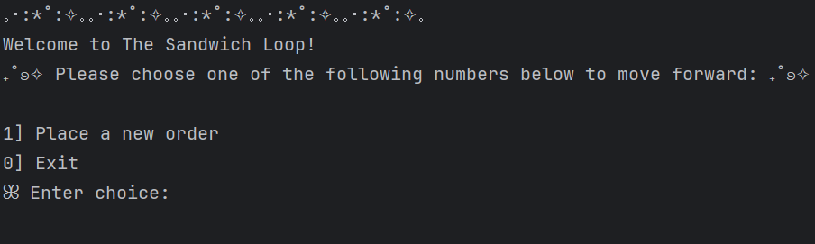
  </td>
</tr>
</table>

## Order Screen

<table align="center">
<tr>
  <td>
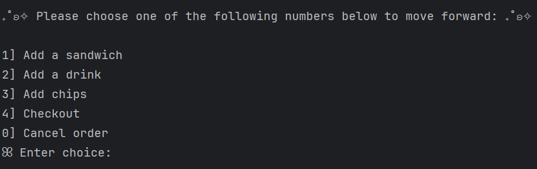
  </td>
</tr>
</table>

## Sandwich Building

<table align="center">
<tr>
  <td>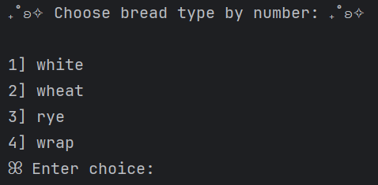</td>
  <td>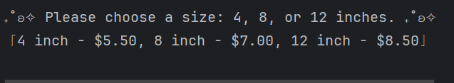</td>
</tr>
</table>

<table align="center">
<tr>
  <td>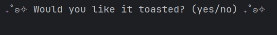</td>
</tr>
</table>

<table align="center">
<tr>
<td>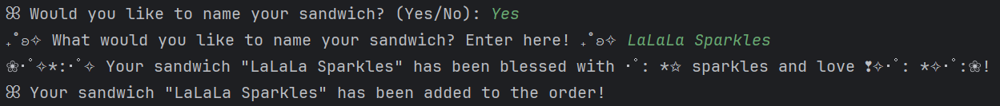</td>
  <tr>
    <td align="center">This app includes a hidden Easter Egg! 
                      Try entering the secret phrase "sparkles" or "love" 
                      when naming your sandwich for a special surprise!</td>
  </tr>
</tr>
</table>

<table align="center">
<tr>
  <td>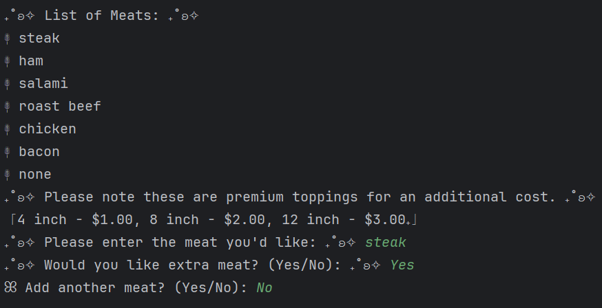</td>
  <td>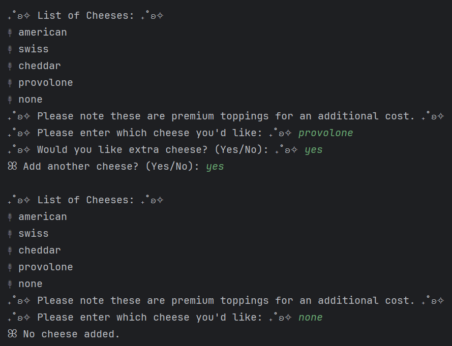</td>
  <tr>
    <td align="center">List of Meats</td>
    <td align="center">List of Cheeses</td>
  </tr>
</tr>
</table>

<table align="center">
<tr>
  <td>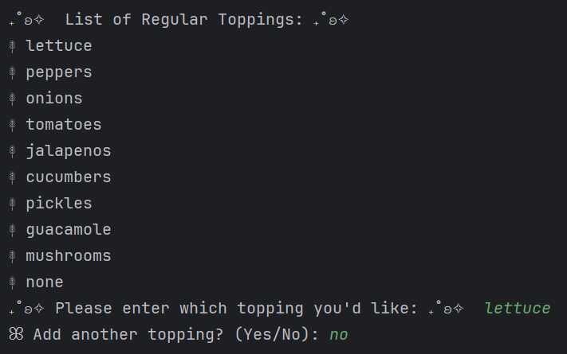</td>
  <td>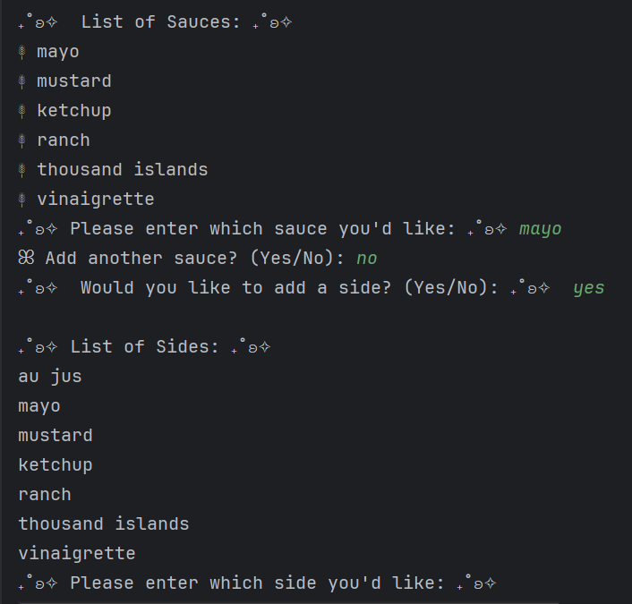</td>
  <tr>
    <td align="center">Regular Toppings</td>
    <td align="center">List of Sauces and Sides</td>
  </tr>
</tr>
</table>

                 
<table align="center">
<tr>
  <td>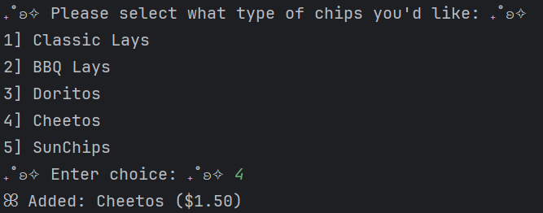</td>
  <td>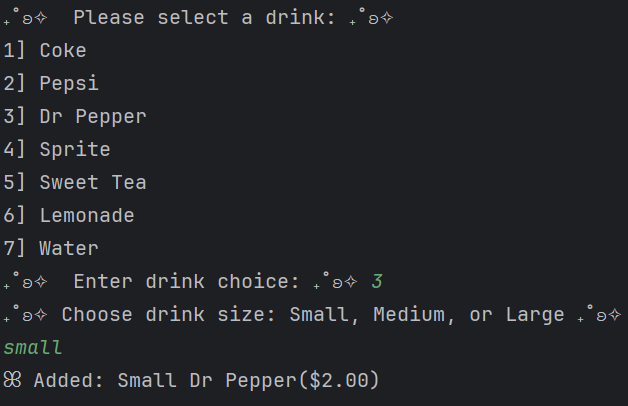</td>
  <tr>
    <td align="center">Chips Menu</td>
    <td align="center">Drink Menu</td>
  </tr>
</tr>
</table>

                
                  
<table align="center">
<tr>
  <td>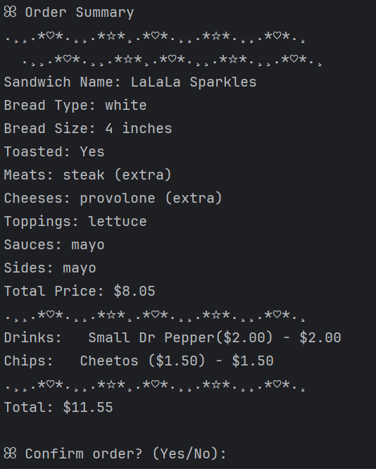</td>
  <td>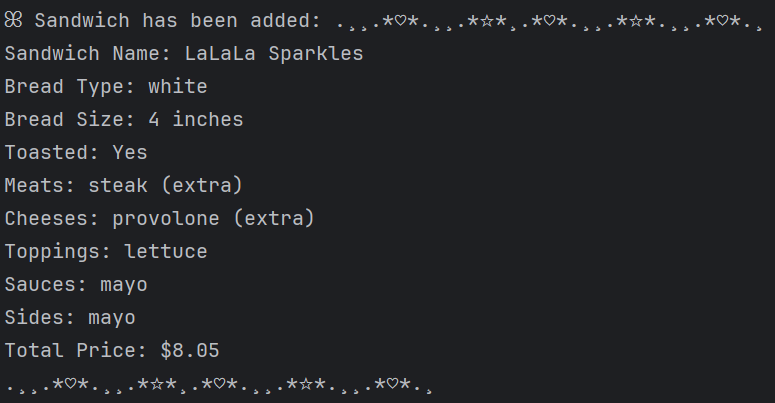</td>
  <tr>
    <td align="center">Check Out Order Summary</td>
    <td align="center">Sandwich Added To Order</td>
  </tr>
</tr>
</table>

<table align="center">
<tr>
  <td>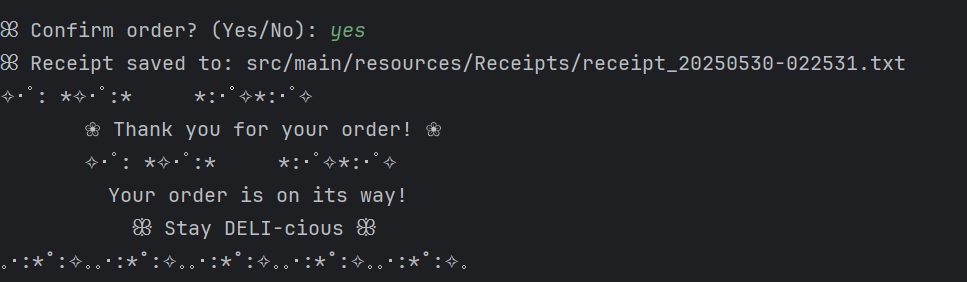</td>
  <tr>
    <td align="center">Confirmed Order</td>
  </tr>
</tr>
</table>

<table align="center">
<tr>
  <td>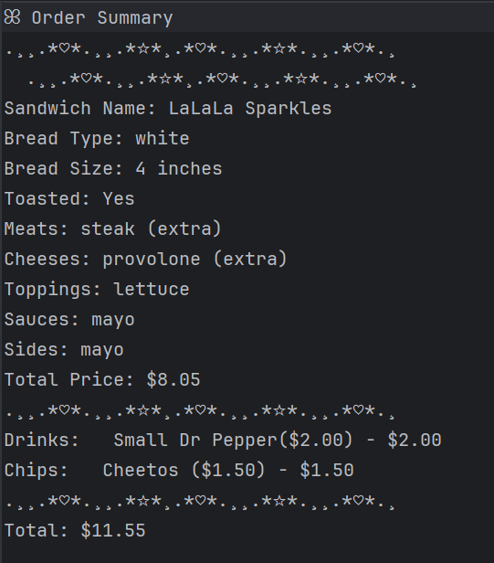</td>
</tr>
  <tr>
    <td align="center">Receipt</td>
  </tr>
</table>
